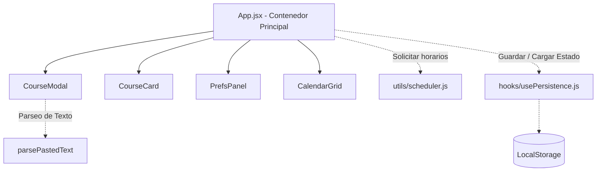
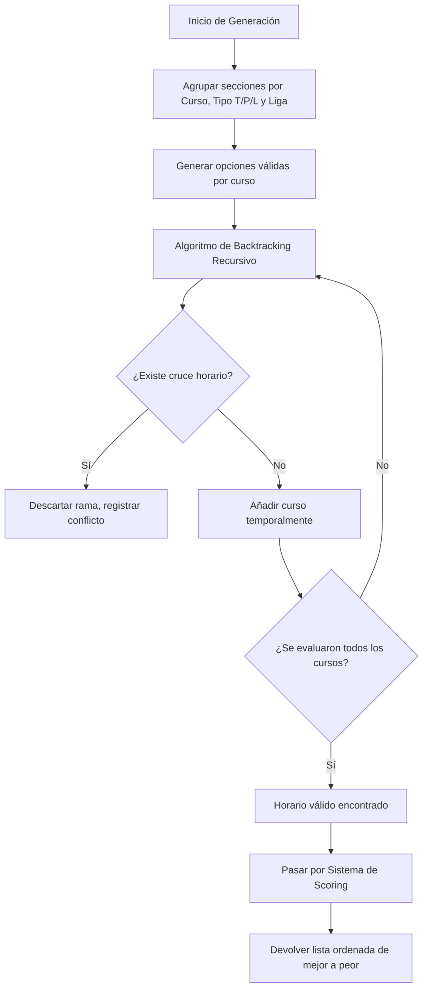

# 📅 Generador de Horarios Universitarios

Un aplicativo web interactivo y dinámico diseñado para ayudar a los estudiantes universitarios a planificar su semestre académico sin estrés. Esta herramienta permite ingresar las clases disponibles (manual o pegando directamente el texto del sistema universitario) y genera automáticamente todas las combinaciones posibles de horarios sin cruces, ordenadas según las preferencias del estudiante.

---

## ✨ Características Principales

*   **Ingreso Híbrido de Datos**: Permite agregar clases manualmente o copiar y pegar bloques de texto directamente desde la intranet universitaria, analizando automáticamente los días, horas, NRC, tipos (Teoría, Práctica, Laboratorio) y aula.
*   **Motor de Generación y Detección de Cruces**: Algoritmo que busca todas las combinaciones posibles, descartando al instante aquellas donde exista superposición de horas.
*   **Sistema de Ligas**: Soporta dependencias lógicas donde una práctica y un laboratorio están atados a una teoría específica (Ligas).
*   **Filtros y Sistema de *Scoring***: Evalúa y puntúa los horarios generados basándose en preferencias como:
    *   Preferencia de Turno (Mañana o Tarde).
    *   Días a la semana (Búsqueda de horarios compactos).
    *   Distribución TPL (Orden cronológico ideal: Teoría -> Práctica -> Laboratorio).
    *   Huecos (Minimizar los tiempos muertos entre clases).
*   **Persistencia Local**: Guarda todo tu avance y configuración en el navegador (`localStorage`) para no perder la información al recargar.
*   **Interfaz Amigable**: Grilla visual de calendario para observar claramente cómo se acomodan las clases en la semana.

---

## 🛠 Tecnologías y Herramientas

*   **Core**: [React 19](https://react.dev/)
*   **Bundler**: [Vite 6](https://vitejs.dev/) - Para una experiencia de desarrollo ultrarrápida.
*   **Estilos**: CSS Puro (con enfoque en variables CSS para temas y diseño adaptable).
*   **Estado**: React Hooks (`useState`, `useCallback`, `useMemo`) y un Hook personalizado para persistencia.

---

## 🏗 Arquitectura del Sistema

El proyecto está diseñado bajo un enfoque basado en componentes, separando la lógica de la interfaz (UI) de los algoritmos de combinación (Core/Backend).

### Diagrama de Componentes Generales



### Componentes Clave

1.  **`App.jsx`**: Es el orquestador principal. Maneja el estado global de los cursos agregados, los horarios generados y las preferencias. Se encarga de comunicar los distintos componentes.
2.  **`CourseModal.jsx`**: Formulario modal que permite la entrada manual de sesiones de clase, así como una pestaña dedicada al "parseo inteligente" de texto pegado.
3.  **`CalendarGrid.jsx`**: Renderiza el horario generado en una grilla de calendario visual, calculando las alturas y posiciones en base a los minutos absolutos desde las 07:00 hasta las 22:00.
4.  **`PrefsPanel.jsx`**: Componente lateral para que el usuario defina los parámetros del algoritmo (Turno, Huecos, Distribución).
5.  **`usePersistence.js`**: Custom hook de React encargado de sincronizar cualquier cambio de estado con el LocalStorage del navegador de manera transparente.

---

## 🧠 El Motor de Generación (scheduler.js)

El núcleo algorítmico (`src/utils/scheduler.js`) utiliza **Backtracking** (vuelta atrás) acoplado a un sistema heurístico de evaluación (*Scoring*). 

### Flujo del Algoritmo



### 1. Sistema de Ligas y Opciones
Antes de mezclar clases, el algoritmo agrupa las sesiones de cada curso. Si un curso tiene "Ligas" (identificadores que unen una Teoría con una Práctica específica), el algoritmo restringe las permutaciones internamente usando Producto Cartesiano, evitando combinaciones de Teoría 1 con Práctica 2.

### 2. Detección de Cruces
Se convierte la representación de hora ("HH:MM") a minutos totales desde la medianoche. Dos sesiones chocan si ocurren el mismo día y la condición de traslape matemático `(Inicio A < Fin B) AND (Inicio B < Fin A)` es verdadera.

### 3. Heurística (Scoring)
Una vez que se encuentran todos los horarios válidos sin cruces, pasan por un tamiz de calificación:
*   Puntaje base: `1000`.
*   Penalizaciones masivas (`-500`) si el orden pedagógico es violado (Ej. Laboratorio ocurre antes que la Teoría en la semana).
*   Penalizaciones proporcionales (`-10 * días`) por usar más días de la semana, premiando horarios de pocos días.
*   Penalizaciones absolutas si el usuario exige un turno (Mañana/Tarde) y el horario se sale de ese margen.

---

## 🚀 Instalación y Uso Local

Sigue estos pasos para clonar y ejecutar el entorno en tu máquina:

1.  **Clona el repositorio**
    ```bash
    git clone https://github.com/Rosas04/Generador-Horario.git
    cd Generador-Horario
    ```

2.  **Instala las dependencias**
    ```bash
    npm install
    ```

3.  **Ejecuta el servidor de desarrollo**
    ```bash
    npm run dev
    ```

4.  **Abre en el navegador**
    La terminal te indicará una ruta local (usualmente `http://localhost:5173/`).

---

## 📝 Metodologías

Durante el desarrollo de este aplicativo se aplicaron los siguientes principios:
*   **Modularidad**: Separación de las responsabilidades lógicas (parser, scheduler) de los componentes visuales de React.
*   **Mobile-First & Responsive Design**: CSS diseñado con Flexbox y CSS Grid para asegurar que la visualización del horario sea legible desde cualquier dispositivo.
*   **UX sin fricción**: Se optó por persistencia automática en lugar de obligar al usuario a crearse una cuenta o presionar botones de "Guardar".

## 📜 Licencia
Este proyecto es de uso abierto. Puedes bifurcarlo (fork), estudiarlo y adaptarlo a tu centro de estudios.
